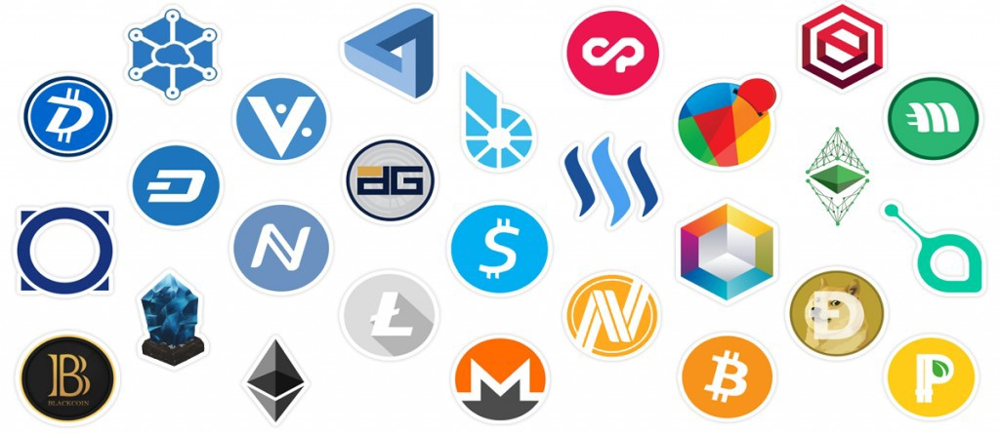

<h1 align="center">
	
	<br>
	<br>
</h1>

[](https://www.codacy.com/app/ZoranPandovski/pycoincap?utm_source=github.com&amp;utm_medium=referral&amp;utm_content=ZoranPandovski/pycoincap&amp;utm_campaign=Badge_Grade)
[](https://github.com/ZoranPandovski/pycoincap)
[](https://coveralls.io/github/ZoranPandovski/pycoincap?branch=master)
[](https://github.com/ZoranPandovski/pycoincap/issues)
[](https://opensource.org/licenses/MIT)

# Pycoincap
Python module for getting data from Coinmarketcap, cryptocurrencies market cap, rankings, price, supply, circulating supply and other useful informations.


# Run tests
```
 python -m unittest pycoincap.tests.test_core
```

## Installation:

From source use
```
   git clone https://github.com/ZoranPandovski/pycoincap
   cd pycoincap
   python setup.py
   pip install -r requirements.txt
```

## Examples:
Retrieve informations from https://coinmarketcap.com/

Get coin informations
```python
from pycoincap import CryptoMarket as market

# Load data data from coinmarketcap
m = market()

# Returns coin object
BTC = m.coin('bitcoin')

print BTC
>>> Coin: Bitcoin
    Ranked: 1
    Price : 4775.44 $
    Price BTC: 1.0
    Available supply: 16613825.0
    Total supply: 16613825.0
    Percent changes:1h  = -0.89
            24h = 8.35
            1d  = 3.74

print BTC.price_usd
>>> 4775.44
```

Get stats
```python
from pycoincap import CryptoMarket as market

# Load data data from coinmarketcap
m = market()

#Returns stats
stats = m.stats()

print stats
>>>  Market value: 52.41$
     Bitcoin percentage: 1.51106247425e+11
     Active markets: 5665
     Active assets: 279
     Active currencies: 874
     Last day changes: 4451850464.0
```
